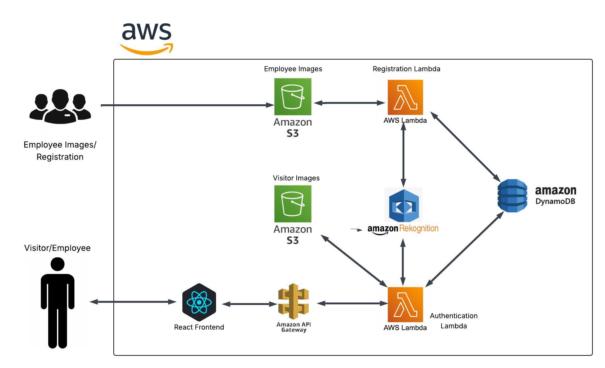

# FaceSense: AI Powered Attendance for Offices and Colleges (AWS-based)

**FaceSense** is a smart face recognition system that automates attendance marking using AWS services. It captures images from a webcam, sends them to the backend, and authenticates users using facial recognition making attendance seamless and contactless.

---

## ✨ Features

- 🔒 Face-based secure authentication
- ☁️ Fully serverless with AWS Lambda, S3, and DynamoDB
- 🎯 Real-time face comparison with Amazon Rekognition
- 💻 Simple React-based frontend
- 🧑‍💼 Separate flows for registration and attendance
- 🏫 Works for both offices and colleges

---

## 🚀 Tech Stack

- **Frontend:** React
- **Backend:** AWS Lambda, API Gateway
- **Face Recognition:** Amazon Rekognition
- **Database:** Amazon DynamoDB
- **Storage:** Amazon S3

---

## 🛠️ System Workflow

### 🔹 Registration Process
- A user's(employee/student) image is **uploaded manually** to a dedicated S3 bucket (e.g., `facesense-registered-users`).
- The image upload triggers an **AWS Lambda function**, which:
  - Uses **Amazon Rekognition** to index the face.
  - Assigns a **unique ID**.
  - Stores the metadata (e.g., name, ID, image path) in **Amazon DynamoDB**.

### 🔹 Attendance Marking Process
- **User camera** captures a real-time image via the **React frontend**.
- The image is sent through **AWS API Gateway** to a **Lambda function**.
- The Lambda function:
  - Stores the image in a separate S3 bucket (e.g., `facesense-visitor-logs`).
  - Invokes **Amazon Rekognition** to match the face against the registered users.
  - Logs the result or fetches match details from **DynamoDB**.
- The **frontend** receives the response (authenticated or not) and displays/logs the outcome accordingly.


---

## 📂 Project Structure
```
my-app/
│
├── public/
│ ├── Index.html
│ └── ...
│
├── src/
│ ├── App.js
│ ├── App.css
│ ├── Index.css
│ └── ...
│ 
├── .env.example (Create a `.env` file with your AWS endpoint variables.)
├── .gitignore
├── package.json
└── ...
```

---

## 🧠 System Architecture



---

### 📦 Setup
1. Clone the repo.
2. Run `npm install`.
3. Create a `.env` file with your AWS endpoint variables.
4. Run the app using `npm start`.

### 📄 License
MIT

---

*Built for modern attendance needs — contactless, intelligent, and efficient.*
